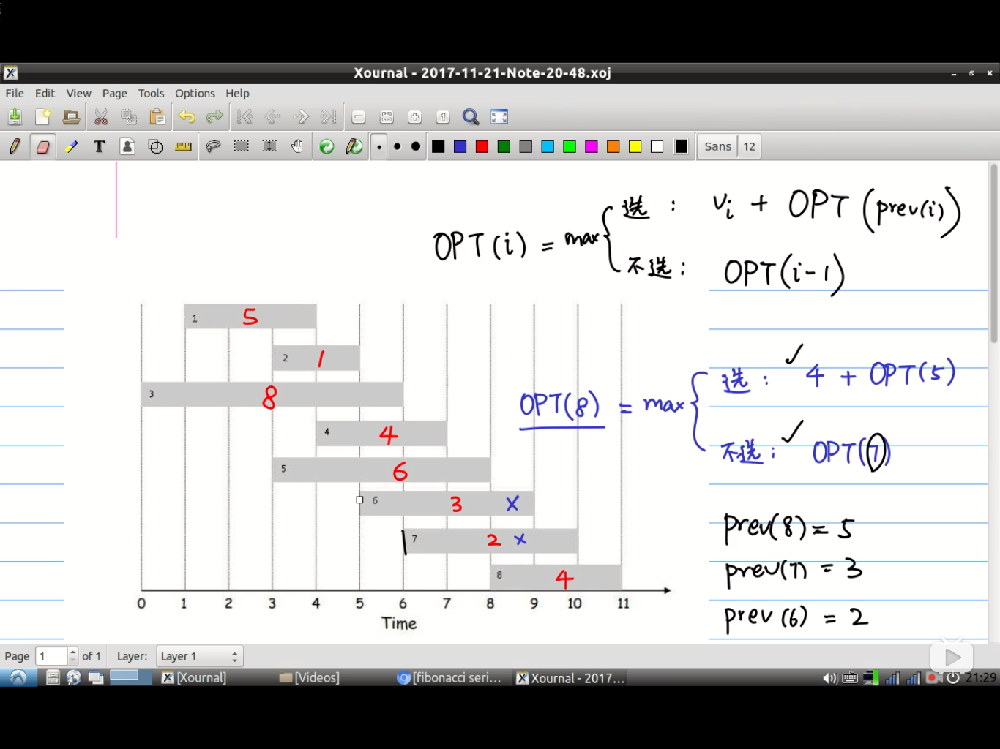

# dp动态规划

1. Fibnoacci Sequence：

   1. 直接代递归式，大量冗余操作，时间复杂度$O(2^n)$.
   2. 重叠子问题：保存阶段性结果

2. 例题：红字表示价值$V_i$,横轴表示时间；；prev(i),表示如果选了第i个任务，那么最多在前面只能做第prev(i))个OPT表示最优解。

   

   根据第$i$个任务选或不选建立递推式。$prev(i)$建立与$i$的映射

   | i    | prev(i) | OPT(i)                | 选择的任务列表 |
   | ---- | ------- | --------------------- | -------------- |
   | 1    | 0       | 5                     | [1]            |
   | 2    | 0       | $max\{OPT(1),0+1\}=5$ | [1]            |
   | 3    | 0       | $max\{OPT(2),0+8\}=8$ | [3]            |
   | 4    | 1       | 9                     | [1,4]          |
   | 5    | 0       | 9                     | [1,4]          |
   | 6    | 2       | 9                     | [1,4]          |
   | 7    | 3       | 10                    | [3,7]          |
   | 8    | 5       | 13                    | [1,4,8]        |

   画递推树，发现重叠子问题，通过数组保存中间结果。

   实现的时候不要用递归的思想从后往前找出口，而是从前往后做，这样可以通过保存中间结果消除重叠子问题。

   ```python3
   
   ```

   

   