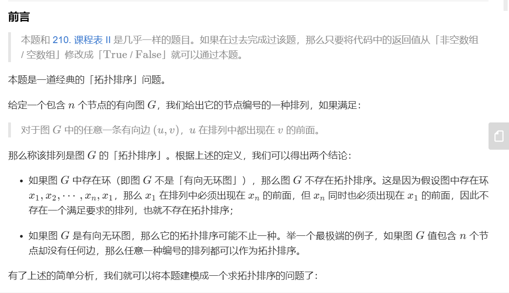

# Leetcode笔记

## 前置的语法：STL

1. C++声明二维数组

   ```c++
   int m=grid.size();
   int n=grid[0].size();
   auto dp = vector < vector <int> > (m, vector <int> (n));
   ```

   或者

   ```c++
   //输入vector<int> &triangle
   vector<vector<int>> dp(triangle.size(),vector<int>(triangle.size(),0));
   ```

   C++里数组长度是用`triangle.size()`

## 题型一：两数/三数/四数之和：使用散列表/双指针降复杂度

1. 第一题：两数之和：从数组中找到两个数使其和为target，返回索引值。

   **优质解法：利用哈希表优化时间复杂度，以空间换时间把查找时间从O(n)降到O(1)**

   > hashmap：直接查找关键字值的数据结构

2. 第15题：三数之和：从数组中找到和为0的三个数的所有不重复组合。

   **关键技术：双指针**

   第一个指针first=0，1，……n-3，第二个指针second=first+1，first+2，…… n-2。在第二个指针从左往右走的同时，第三个指针从右往左走，检查两个指针指向的数的和。因为总共走了N步，所以把时间复杂度从$O(N^2)$降到了$O(N)$.（srds python还是过不了）

3. 第18题：四数之和

   **关键技术：哈希表保存所有可能的两数之和**

## 题型二：括号匹配问题：使用栈/动态规划

1. 第20题：判断括号是否匹配：左括号入栈，右括号检查栈顶元素是否匹配，若匹配则栈顶出栈。

2. 第32题（hard）：寻找最长有效括号：

   1. 栈方法：进栈的元素是下标！

      具体实现：1. 初始将-1入栈。2. 遇到左括号将其下标入栈。遇到右括号将栈顶出栈，然后用当前index减去栈顶元素得到最长长度。如果此时栈已经为空，则将右括号下标入栈表示数组已经被该右括号分割。

   2. 动态规划方法

---

## 题型三：动态规划方法

1. 第九题：数字回文数：判断一个32位的整数是否是回文数

   1. 如果将数字转变成字符串则空间代价比较大。
   2. 可以不转换字符串，直接对数字进行操作：反转后半部分的数字，检查是否与前半部分相同。

2. 第三题：无重复字符最长子串

   1. 滑动窗口：利用哈希集合。

3. 第990题：等式方程的可满足性

   1. 并查集

      

## 题型四：树相关知识

1. 第1379题：找出克隆二叉树中的target结点：同时遍历两棵树。用栈/队列代替递归操作进行遍历。

2. 面试题04.10：检查子树：检查T2是否是T1的子树：

   ```c++
   /**
    * Definition for a binary tree node.
    * struct TreeNode {
    *     int val;
    *     TreeNode *left;
    *     TreeNode *right;
    *     TreeNode(int x) : val(x), left(NULL), right(NULL) {}
    * };
    */
   
   class solution{
       public:
       bool checkSubTree(TreeNode*t1,TreeNode*t2){
           //判断T2是否是T1的子树
           if(t2==NULL) return true;
           if(t1==NULL) return false;
           if(t1->val==t2->val){
               return checkSubTree(t1->left,t2->left) && 
                   checkSubTree(t1->right,t2->right);
           }
           if(t1->val!=t2->val){
               return checkSubTree(t1->left,t2)||checkSubTree(t1->right,t2);
           }
       }
   }
   ```

3. 1367题：二叉树中的列表：递归

4. 144题：前序遍历返回列表：

   1. 递归：定义全局变量+定义void函数才可以递归调用

      ```c++
      class Solution {
          vector<int> ans;
      public:
          void preorder(TreeNode *root){
              if(root==NULL) return;
              ans.push_back(root->val);
              preorder(root->left);
              preorder(root->right);
          }
          vector<int> preorderTraversal(TreeNode* root) {
              preorder(root);
              return ans;
          }
      };
      ```

   2. 递归改栈：右子树进栈->左子树进栈->root进栈

      ```c++
      class Solution {
      public:
          vector<int> preorderTraversal(TreeNode* root) {
              if(root==NULL) return {};
              stack<TreeNode*> s;
              vector<int> ans;
              s.push(root);
              while(!s.empty()){
                  TreeNode* cur=s.top();
                  ans.push_back(cur->val);
                  s.pop();
                  if(cur->right) s.push(cur->right);
                  if(cur->left) s.push(cur->left);
              }
              return ans;
          }
      };
      ```

5. dfs：第1315题：求祖父节点为偶数的节点值之和

   ```c++
   class Solution {
       int sum=0;
   public:
       void dfs(int grandPa_val,int parent_val,TreeNode* node){
           if(node==NULL) return;
           if(grandPa_val%2==0){
               sum+=node->val;
           }
           dfs(parent_val,node->val,node->left);
           dfs(parent_val,node->val,node->right);
       }
       int sumEvenGrandparent(TreeNode* root) {
           dfs(1,1,root);
           return sum;
       }
   };
   ```

   - dfs要定义成void，返回值定义成全局的
   - 考虑到要讨论root下两层的节点存在性，可以把原来设计的`dfs(TreeNode* GrandPa, TreeNode* pa,TreeNode* node)`改成`dfs(int grandpa_val,int parent_val,TreeNode *node)`，然后把root上面两层设虚拟节点值1。

## 题型五：无序三重循环降复杂度：

1. 第1395题：统计作战单位数：给定无序int数组ratings，找到i，j，k，使得i，j，k有序且ratings[i],ratings[j],ratings[k]也有序

   **关键思路：枚举中间点**

   ```c++
   class Solution {
   public:
       int numTeams(vector<int>& rating) {
           if(rating.size()<=2) return 0;
           int cnt=0;
           for(int j=1;j<rating.size()-1;j++){
               //枚举中间点
               int leftLess=0;
               int leftMore=0;
               int rightLess=0;
               int rightMore=0;
               for(int i=0;i<j;i++){
                   if(rating[i]<rating[j]){
                       leftLess++;
                   }
                   else if(rating[i]>rating[j]){
                       leftMore++;
                   }
               }
               for(int k=j+1;k<rating.size();k++){
                   if(rating[k]>rating[j]){
                       rightMore++;
                   }
                   else if(rating[k]<rating[j]){
                       rightLess++;
                   }
               }
               cnt+=leftLess*rightMore+leftMore*rightLess;
           }
           return cnt;
       }
   };
   ```


## 题型六：博弈问题：包含先后手转换

<https://leetcode-cn.com/problems/stone-game/solution/jie-jue-bo-yi-wen-ti-de-dong-tai-gui-hua-tong-yong/>

1. 第877题：石子游戏：很多堆石子数组，每次只能拿走最左边或者最右边的一堆；假设两个人都贼精明，求谁嬴谁输。

   通用解法：区间dp

   1. `dp[i][j]`定义成在区间`piles[i…j]`中间的最优解。它是一个元组，包含了`(first,second)`两个值。`dp[i][j].first`表示先手在区间中的最大值，`dp[i][j].second`表示后手在区间中的最大值。

   2. 状态转移方程：包含先后手转换

      

      ```c++
      class Solution {
      public:
          bool stoneGame(vector<int>& piles) {
              //dp[i][j][0]表示从piles[i......j]，先手获得的最大值
              //dp[i][j][1]表示从piles[i......j]，后手获得的最大值
              //状态转移方程：
              //dp[i][j][0]=max(piles[i]+dp[i+1][j][1],piles[j]+dp[i][j-1][1])
              //dp[i][j][1]=
              //初始化
              //if j==i dp[i][j][0]=piles[i],dp[i][j][1]=0
              //if j==i+1 dp[i][j][0]=max(piles[i],piles[i+1]),dp[i][j][1]=min(piles[i],piles[i+1]);
              //return dp[0][n-1][0]>dp[0][n-1][1]
              int n=piles.size();
              if(n<=2) return true;
              vector<vector<vector<int>>> dp(n,vector<vector<int>>(n,vector<int>(2,0)));
              //initialize:
              for(int i=0;i<n-1;i++){
                  dp[i][i][0]=piles[i];
                  dp[i][i][1]=0;
                  dp[i][i+1][0]=max(piles[i],piles[i+1]);
                  dp[i][i+1][1]=min(piles[i],piles[i+1]);
              }
              dp[n-1][n-1][0]=piles[n-1];
              dp[n-1][n-1][1]=0;
      
              for(int i=n-3;i>=0;i--){
                  for(int j=i+2;j<n;j++){
                      int left=piles[i]+dp[i+1][j][1];
                      int right=piles[j]+dp[i][j-1][1];
                      if(left>right){
                          //选左边一堆
                          dp[i][j][0]=left;
                          dp[i][j][1]=dp[i+1][j][0];
                      }
                      else{
                          dp[i][j][0]=right;
                          dp[i][j][1]=dp[i][j-1][0];
                      }
                  }
              }
              return dp[0][n-1][0]>dp[0][n-1][1];
          }
      };
      ```

   3. 1147 石子游戏2：字节笔试题：一直debug不出来的动态规划：每次拿X堆，$1\le X \le 2M$，初始$M=1$，$M$的迭代方程：$M=max(M,X)$.

      ```c++
      #include<vector>
      #include<iostream>
      #include<algorithm>
      using namespace std;
      
      int getLarger(double x) {
      	if (x == int(x)) return int(x);
      	else return int(x) + 1;
      }
      
      int stoneGame_2(vector<int>& piles) {
      	//dp方法解答：这可太复杂了
      	//1.状态定义：
      	//dp[i][j][0]表示从piles[i]开始拿，M=j的情况下先手的最优值
      	//dp[i][j][1]表示………………后手
      
      	//2.状态转移方程：
      	//dp[i][j][0]=max(piles[i]+...+piles[k-1]+dp[k][max(j,k-i)][1]);
      	//dp[i][j][1]=dp[k][max(j,k-i)][0];
      	//k表示从第i堆拿到第k-1堆，一共拿了X=k-i堆，所以k的范围是[i+1,min(n,i+2j)]
      
      	//3.初始化条件：
      	//dp[i][ceil((n-i+1)/2)][0]=piles[i]+...+piles[n-1];
      	//dp[i][ceil((n-i+1)/2)][1]=0
      
      	//4.返回值
      	//return dp[0][1][0]
      
      	if (piles.size() == 0) return 0;
      	if (piles.size() == 1) return piles[0];
      	if (piles.size() == 2) return piles[0] + piles[1];
      
      	//initialize:
      	int n = piles.size();
      	vector<vector<vector<int>>> dp(n, vector<vector<int>>(n, vector<int>(2, 0)));
      	for (int i = 0; i < n; i++) {
      		for (int j = getLarger((n - i) / 2.0); j < n; j++) {
      			for (int k = i; k < n; k++) {
      				dp[i][j][0] += piles[k];
      			}
      			dp[i][j][1] = 0;
      		}
      	}
      
      	//迭代开始：
      	for (int i = n - 1; i >= 0; i--) {
      		for (int j = 1; j < getLarger((n - i) / 2.0); j++) {
      			dp[i][j][0] = piles[i] + dp[i + 1][1][1];
      			dp[i][j][1] = dp[i + 1][1][0];
      			for (int k = i + 1; k < min(n + 1, i + 2 * j + 1); k++) {
      				//getsum
      				int sum = piles[i];
      				for (int t = i + 1; t < k; t++) sum += piles[t];
      				if (sum + dp[k][max(j, k - i)][1] > dp[i][j][0]) {
      					dp[i][j][0] = sum + dp[k][max(j, k - i)][1];
      					dp[i][j][1] = dp[k][max(j, k - i)][0];
      				}
      			}
      		}
      	}
      	return dp[0][1][0];
      }
      
      int main() {
      	vector<int> piles;
      	int a[8] = { 2,3,44,4,33,45,100,900 };
      	piles.insert(piles.begin(), a, a + 8);
      	return stoneGame_2(piles);
      }
      //测试样例过一半，如果测试样例为[2,3,44,4,33,45,100,900]则过不了，单步执行发现dp[1][3]=229/900，错了；别的dp值都正常。
      ```

      累了累了 咸了咸了bye

## 回溯算法：

1. 第46题：给定无重复数字的数列，返回全排列

   搜索回溯：视为插空。定义函数`traceback(first,output)`表示以first开头，输出为output的数组

   ```c++
   class Solution {
   public:
       void backtrack(vector<vector<int>>& res, vector<int>& output, int first, int len){
           // 所有数都填完了
           if (first == len) {
               res.emplace_back(output);
               return;
           }
           for (int i = first; i < len; ++i) {
               // 动态维护数组
               swap(output[i], output[first]);
               // 继续递归填下一个数
               backtrack(res, output, first + 1, len);
               // 撤销操作
               swap(output[i], output[first]);
           }
       }
       vector<vector<int>> permute(vector<int>& nums) {
           vector<vector<int> > res;
           backtrack(res, nums, 0, (int)nums.size());
           return res;
       }
   };
   ```

   用swap的方法降空间复杂度，减少了一个标记是否已经使用的数组。

## 拓扑排序:

1. 题207：考虑先修课程的课表，判断是否可行

   

   拓扑排序的时间复杂度是$O(V(G)+E(G))$.

   对于本题的建模：

   - 将每一门课看成一个结点
   - 如果B是A的先修课，那么从B到A连一条有向边。
   - 本题可以约化为判断是否为有向无环图

   算法流程：维护一个入度表+BFS

   1. 统计入度，维护入读表
   2. 将所有入度为0的结点入队
   3. 在队列非空时将首节点出队，然后将出队结点指向的结点入度减一。将此时入度为0的结点入队。
   4. 每次出队时执行`numCourses--`，如果出循环时`numCourses==0`那么return true；

## 哈希表

1. 1282题：用户分组

   

## 动态规划

与递归思想类似，保存递归中间结果，省去解决重复子问题的时间。

1. 第337题 打家劫舍3：二叉树动态规划，如果有直接连线（父子关系）则不能偷。

   

```c++
class Solution {
public:
    unordered_map<TreeNode*,int> f,g;
    void dfs(TreeNode* o){
        if(!o) return;
        dfs(o->left);
        dfs(o->right);
        f[o]=o->val+g[o->left]+g[o->right];
        g[o]=max(f[o->left],g[o->left])+max(f[o->right],g[o->right]);
    }
    int rob(TreeNode* root) {
        if(!root) return 0;
        dfs(root);
        return max(f[root],g[root]);
    }
};
```

## 字典树

1. 基本性质：
   1. 根节点不包含字符，除根节点外每一个结点都只包含一个字符
   2. 从根节点到某一节点，路径上经过的字符连接起来为该结点的字符串
   3. 每个结点的所有子结点包含的字符都不相同