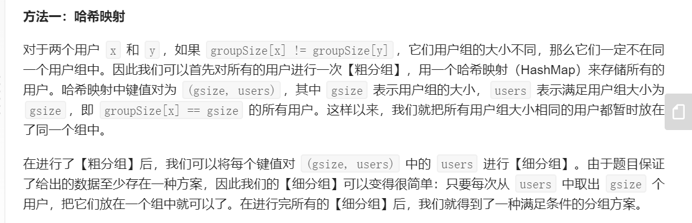

# Leetcode笔记

## 前置的语法：STL

1. C++声明二维数组

   ```c++
   int m=grid.size();
   int n=grid[0].size();
   auto dp = vector < vector <int> > (m, vector <int> (n));
   ```

   或者

   ```c++
   //输入vector<int> &triangle
   vector<vector<int>> dp(triangle.size(),vector<int>(triangle.size(),0));
   ```

   C++里数组长度是用`triangle.size()`

## 题型一：两数/三数/四数之和：使用散列表/双指针降复杂度

1. 第一题：两数之和：从数组中找到两个数使其和为target，返回索引值。

   **优质解法：利用哈希表优化时间复杂度，以空间换时间把查找时间从O(n)降到O(1)**

   > hashmap：直接查找关键字值的数据结构

2. 第15题：三数之和：从数组中找到和为0的三个数的所有不重复组合。

   **关键技术：双指针**

   第一个指针first=0，1，……n-3，第二个指针second=first+1，first+2，…… n-2。在第二个指针从左往右走的同时，第三个指针从右往左走，检查两个指针指向的数的和。因为总共走了N步，所以把时间复杂度从$O(N^2)$降到了$O(N)​$.（srds python还是过不了）

3. 第18题：四数之和

   **关键技术：哈希表保存所有可能的两数之和**

## 题型二：括号匹配问题：使用栈/动态规划

1. 第20题：判断括号是否匹配：左括号入栈，右括号检查栈顶元素是否匹配，若匹配则栈顶出栈。

2. 第32题（hard）：寻找最长有效括号：

   1. 栈方法：进栈的元素是下标！

      具体实现：1. 初始将-1入栈。2. 遇到左括号将其下标入栈。遇到右括号将栈顶出栈，然后用当前index减去栈顶元素得到最长长度。如果此时栈已经为空，则将右括号下标入栈表示数组已经被该右括号分割。

   2. 动态规划方法

---

## 题型三：动态规划方法

1. 第九题：数字回文数：判断一个32位的整数是否是回文数

   1. 如果将数字转变成字符串则空间代价比较大。
   2. 可以不转换字符串，直接对数字进行操作：反转后半部分的数字，检查是否与前半部分相同。

2. 第三题：无重复字符最长子串

   1. 滑动窗口：利用哈希集合。

3. 第990题：等式方程的可满足性

   1. 并查集

      

## 题型四：树相关知识

1. 第1379题：找出克隆二叉树中的target结点：同时遍历两棵树。用栈/队列代替递归操作进行遍历。

2. 面试题04.10：检查子树：检查T2是否是T1的子树：

   ```c++
   /**
    * Definition for a binary tree node.
    * struct TreeNode {
    *     int val;
    *     TreeNode *left;
    *     TreeNode *right;
    *     TreeNode(int x) : val(x), left(NULL), right(NULL) {}
    * };
    */
   
   class solution{
       public:
       bool checkSubTree(TreeNode*t1,TreeNode*t2){
           //判断T2是否是T1的子树
           if(t2==NULL) return true;
           if(t1==NULL) return false;
           if(t1->val==t2->val){
               return checkSubTree(t1->left,t2->left) && 
                   checkSubTree(t1->right,t2->right);
           }
           if(t1->val!=t2->val){
               return checkSubTree(t1->left,t2)||checkSubTree(t1->right,t2);
           }
       }
   }
   ```

3. 1367题：二叉树中的列表：递归

4. 144题：前序遍历返回列表：

   1. 递归：定义全局变量+定义void函数才可以递归调用

      ```c++
      class Solution {
          vector<int> ans;
      public:
          void preorder(TreeNode *root){
              if(root==NULL) return;
              ans.push_back(root->val);
              preorder(root->left);
              preorder(root->right);
          }
          vector<int> preorderTraversal(TreeNode* root) {
              preorder(root);
              return ans;
          }
      };
      ```

   2. 递归改栈：右子树进栈->左子树进栈->root进栈

      ```c++
      class Solution {
      public:
          vector<int> preorderTraversal(TreeNode* root) {
              if(root==NULL) return {};
              stack<TreeNode*> s;
              vector<int> ans;
              s.push(root);
              while(!s.empty()){
                  TreeNode* cur=s.top();
                  ans.push_back(cur->val);
                  s.pop();
                  if(cur->right) s.push(cur->right);
                  if(cur->left) s.push(cur->left);
              }
              return ans;
          }
      };
      ```

5. dfs：第1315题：求祖父节点为偶数的节点值之和

   ```c++
   class Solution {
       int sum=0;
   public:
       void dfs(int grandPa_val,int parent_val,TreeNode* node){
           if(node==NULL) return;
           if(grandPa_val%2==0){
               sum+=node->val;
           }
           dfs(parent_val,node->val,node->left);
           dfs(parent_val,node->val,node->right);
       }
       int sumEvenGrandparent(TreeNode* root) {
           dfs(1,1,root);
           return sum;
       }
   };
   ```

   - dfs要定义成void，返回值定义成全局的
   - 考虑到要讨论root下两层的节点存在性，可以把原来设计的`dfs(TreeNode* GrandPa, TreeNode* pa,TreeNode* node)`改成`dfs(int grandpa_val,int parent_val,TreeNode *node)`，然后把root上面两层设虚拟节点值1。

6. 判断是否满足AVL树条件：自底向上递归

   对于每一个结点root，先判断其左子树、右子树是否满足AVL条件。如果都满足，那么判断对于root是否满足（类似于后序遍历）

   ```c++
   class Solution {
   public:
       int height(TreeNode* root) {
           if (root == NULL) {
               return 0;
           }
           int leftHeight = height(root->left);
           int rightHeight = height(root->right);
           if (leftHeight == -1 || rightHeight == -1 || abs(leftHeight - rightHeight) > 1) {
               return -1;
           } else {
               return max(leftHeight, rightHeight) + 1;
           }
       }
   
       bool isBalanced(TreeNode* root) {
           return height(root) >= 0;
       }
   };
   ```

## 题型五：无序三重循环降复杂度：

1. 第1395题：统计作战单位数：给定无序int数组ratings，找到i，j，k，使得i，j，k有序且ratings[i],ratings[j],ratings[k]也有序

   **关键思路：枚举中间点**

   ```c++
   class Solution {
   public:
       int numTeams(vector<int>& rating) {
           if(rating.size()<=2) return 0;
           int cnt=0;
           for(int j=1;j<rating.size()-1;j++){
               //枚举中间点
               int leftLess=0;
               int leftMore=0;
               int rightLess=0;
               int rightMore=0;
               for(int i=0;i<j;i++){
                   if(rating[i]<rating[j]){
                       leftLess++;
                   }
                   else if(rating[i]>rating[j]){
                       leftMore++;
                   }
               }
               for(int k=j+1;k<rating.size();k++){
                   if(rating[k]>rating[j]){
                       rightMore++;
                   }
                   else if(rating[k]<rating[j]){
                       rightLess++;
                   }
               }
               cnt+=leftLess*rightMore+leftMore*rightLess;
           }
           return cnt;
       }
   };
   ```


## 题型六：博弈问题：包含先后手转换

<https://leetcode-cn.com/problems/stone-game/solution/jie-jue-bo-yi-wen-ti-de-dong-tai-gui-hua-tong-yong/>

但是这种方法经常超时超空间orz---有时间再回去看石子游戏5的题解

> 面对超时的一些修改办法：
>
> - max，min这种函数自己写
> - vector比较慢，改array
> - 控制台能运行通过但是commit会超时也真的是rlgl

1. 第877题：石子游戏：很多堆石子数组，每次只能拿走最左边或者最右边的一堆；假设两个人都贼精明，求谁嬴谁输。

   通用解法：区间dp

   1. `dp[i][j]`定义成在区间`piles[i…j]`中间的最优解。它是一个元组，包含了`(first,second)`两个值。`dp[i][j].first`表示先手在区间中的最大值，`dp[i][j].second`表示后手在区间中的最大值。

   2. 状态转移方程：包含先后手转换

      

      ```c++
      class Solution {
      public:
          bool stoneGame(vector<int>& piles) {
              //dp[i][j][0]表示从piles[i......j]，先手获得的最大值
              //dp[i][j][1]表示从piles[i......j]，后手获得的最大值
              //状态转移方程：
              //dp[i][j][0]=max(piles[i]+dp[i+1][j][1],piles[j]+dp[i][j-1][1])
              //dp[i][j][1]=
              //初始化
              //if j==i dp[i][j][0]=piles[i],dp[i][j][1]=0
              //if j==i+1 dp[i][j][0]=max(piles[i],piles[i+1]),dp[i][j][1]=min(piles[i],piles[i+1]);
              //return dp[0][n-1][0]>dp[0][n-1][1]
              int n=piles.size();
              if(n<=2) return true;
              vector<vector<vector<int>>> dp(n,vector<vector<int>>(n,vector<int>(2,0)));
              //initialize:
              for(int i=0;i<n-1;i++){
                  dp[i][i][0]=piles[i];
                  dp[i][i][1]=0;
                  dp[i][i+1][0]=max(piles[i],piles[i+1]);
                  dp[i][i+1][1]=min(piles[i],piles[i+1]);
              }
              dp[n-1][n-1][0]=piles[n-1];
              dp[n-1][n-1][1]=0;
      
              for(int i=n-3;i>=0;i--){
                  for(int j=i+2;j<n;j++){
                      int left=piles[i]+dp[i+1][j][1];
                      int right=piles[j]+dp[i][j-1][1];
                      if(left>right){
                          //选左边一堆
                          dp[i][j][0]=left;
                          dp[i][j][1]=dp[i+1][j][0];
                      }
                      else{
                          dp[i][j][0]=right;
                          dp[i][j][1]=dp[i][j-1][0];
                      }
                  }
              }
              return dp[0][n-1][0]>dp[0][n-1][1];
          }
      };
      ```

   3. 1147 石子游戏2：字节笔试题：一直debug不出来的动态规划：每次拿X堆，$1\le X \le 2M$，初始$M=1$，$M$的迭代方程：$M=max(M,X)$.

      ```c++
      #include<vector>
      #include<iostream>
      #include<algorithm>
      using namespace std;
      
      int getLarger(double x) {
      	if (x == int(x)) return int(x);
      	else return int(x) + 1;
      }
      
      int stoneGame_2(vector<int>& piles) {
      	//dp方法解答：这可太复杂了
      	//1.状态定义：
      	//dp[i][j][0]表示从piles[i]开始拿，M=j的情况下先手的最优值
      	//dp[i][j][1]表示………………后手
      
      	//2.状态转移方程：
      	//dp[i][j][0]=max(piles[i]+...+piles[k-1]+dp[k][max(j,k-i)][1]);
      	//dp[i][j][1]=dp[k][max(j,k-i)][0];
      	//k表示从第i堆拿到第k-1堆，一共拿了X=k-i堆，所以k的范围是[i+1,min(n,i+2j)]
      
      	//3.初始化条件：
      	//dp[i][ceil((n-i+1)/2)][0]=piles[i]+...+piles[n-1];
      	//dp[i][ceil((n-i+1)/2)][1]=0
      
      	//4.返回值
      	//return dp[0][1][0]
      
      	if (piles.size() == 0) return 0;
      	if (piles.size() == 1) return piles[0];
      	if (piles.size() == 2) return piles[0] + piles[1];
      
      	//initialize:
      	int n = piles.size();
      	vector<vector<vector<int>>> dp(n, vector<vector<int>>(n, vector<int>(2, 0)));
      	for (int i = 0; i < n; i++) {
      		for (int j = getLarger((n - i) / 2.0); j < n; j++) {
      			for (int k = i; k < n; k++) {
      				dp[i][j][0] += piles[k];
      			}
      			dp[i][j][1] = 0;
      		}
      	}
      
      	//迭代开始：
      	for (int i = n - 1; i >= 0; i--) {
      		for (int j = 1; j < getLarger((n - i) / 2.0); j++) {
      			dp[i][j][0] = piles[i] + dp[i + 1][1][1];
      			dp[i][j][1] = dp[i + 1][1][0];
      			for (int k = i + 1; k < min(n + 1, i + 2 * j + 1); k++) {
      				//getsum
      				int sum = piles[i];
      				for (int t = i + 1; t < k; t++) sum += piles[t];
      				if (sum + dp[k][max(j, k - i)][1] > dp[i][j][0]) {
      					dp[i][j][0] = sum + dp[k][max(j, k - i)][1];
      					dp[i][j][1] = dp[k][max(j, k - i)][0];
      				}
      			}
      		}
      	}
      	return dp[0][1][0];
      }
      
      int main() {
      	vector<int> piles;
      	int a[8] = { 2,3,44,4,33,45,100,900 };
      	piles.insert(piles.begin(), a, a + 8);
      	return stoneGame_2(piles);
      }
      //测试样例过一半，如果测试样例为[2,3,44,4,33,45,100,900]则过不了，单步执行发现dp[1][3]=229/900，错了；别的dp值都正常。
      ```

      累了累了 咸了咸了bye

## 题型七：字符串

### 回文子串

1. 第5题：最长回文子串

   1. 简单的$O(N^2)$动态规划算法：

      ```c++
      vector<vector<bool>> dp;
      //dp[i][j]表示s[i...j]是否为回文串
      //dp[i][j]=dp[i+1][j-1] && (s[i]==s[j])
      ```

   2. Manacher算法：在线性时间内求解最长回文子串，一种类似于动态规划的算法，维护一个以每个结点为中心的最长字串长度的数组。

      1. 预处理：同一奇偶字符串的表示：在原字符串的每一个间隔中插入‘#’，如‘aba’经过预处理以后为‘#a#b#a#’，这样预处理以后的字符串一定是奇数串。

      2. 定义R为最长子串最右边界，C为回文子串中心（C和R是伴生的），i为当前遍历数组索引，开始遍历。

         1. i>R，则直接用O(n)的中心拓展算法暴力匹配
         2. i<R，检查i的回文子串长：利用i关于C的对称点i’。
            1. i的回文子串长度对应到数组边界不超过R，则不更新
            2. i的回文子串长度对应到数组边界超过R，更新R，C。

   ```c++
   class Solution {
   public:
    int expand(const string& s, int left, int right) {
        while (left >= 0 && right < s.size() && s[left] == s[right]) {
            --left;
            ++right;
        }
        return (right - left - 2) / 2;
    }
   
    string longestPalindrome(string s) {
        int start = 0, end = -1;
        string t = "#";
        for (char c: s) {
            t += c;
            t += '#';
        }
        t += '#';
        s = t;
   
        vector<int> arm_len;
        int right = -1, j = -1;
        for (int i = 0; i < s.size(); ++i) {
            int cur_arm_len;
            if (right >= i) {
                int i_sym = j * 2 - i;
                int min_arm_len = min(arm_len[i_sym], right - i);
                cur_arm_len = expand(s, i - min_arm_len, i + min_arm_len);
            }
            else {
                cur_arm_len = expand(s, i, i);
            }
            arm_len.push_back(cur_arm_len);
            if (i + cur_arm_len > right) {
                j = i;
                right = i + cur_arm_len;
            }
            if (cur_arm_len * 2 + 1 > end - start) {
                start = i - cur_arm_len;
                end = i + cur_arm_len;
            }
        }
   
        string ans;
        for (int i = start; i <= end; ++i) {
            if (s[i] != '#') {
                ans += s[i];
            }
        }
        return ans;
    }
   };
   
   ```

### 重复子串

1. 题459：判断一个字符串是否可以由其某一子串重复多次生成：

   

## 回溯算法：

1. <https://labuladong.gitbook.io/algo/di-ling-zhang-bi-du-xi-lie/hui-su-suan-fa-xiang-jie-xiu-ding-ban>

   

2. 第46题：给定无重复数字的数列，返回全排列

   搜索回溯：视为插空。定义函数`traceback(first,output)`表示以first开头，输出为output的数组

   ```c++
   class Solution {
   public:
       void backtrack(vector<vector<int>>& res, vector<int>& output, int first, int len){
           // 所有数都填完了
           if (first == len) {
               res.emplace_back(output);
               return;
           }
           for (int i = first; i < len; ++i) {
               // 动态维护数组
               swap(output[i], output[first]);
               // 继续递归填下一个数
               backtrack(res, output, first + 1, len);
               // 撤销操作
               swap(output[i], output[first]);
           }
       }
       vector<vector<int>> permute(vector<int>& nums) {
           vector<vector<int> > res;
           backtrack(res, nums, 0, (int)nums.size());
           return res;
       }
   };
   ```

   用swap的方法降空间复杂度，减少了一个标记是否已经使用的数组。

## 图算法

> 始终考虑：
>
> - bfs？dfs？
> - 邻接矩阵？邻接表？
> - 入度表？出度表？

1. 题1557：找最小点集使其可以到达所有点：找入度为0的点即可。

   ```c++
   class Solution {
   public:
       vector<int> findSmallestSetOfVertices(int n, vector<vector<int>>& edges) {
           vector<int> indegrees(n,0);
           for(int i=0;i<edges.size();i++){
               int from=edges[i][0];
               int to=edges[i][1];
               indegrees[to]++;
           }
           vector<int> ans;
           for(int i=0;i<n;i++){
               if(indegrees[i]==0) ans.push_back(i);
           }
           return ans;
       }
   };
   ```

### 拓扑排序:

1. 题207：考虑先修课程的课表，判断是否可行

   

   拓扑排序的时间复杂度是$O(V(G)+E(G))$.

   对于本题的建模：

   - 将每一门课看成一个结点
   - 如果B是A的先修课，那么从B到A连一条有向边。
   - 本题可以约化为判断是否为有向无环图

   算法流程：维护一个入度表+BFS

   1. 统计入度，维护入读表
   2. 将所有入度为0的结点入队
   3. 在队列非空时将首节点出队，然后将出队结点指向的结点入度减一。将此时入度为0的结点入队。
   4. 每次出队时执行`numCourses--`，如果出循环时`numCourses==0`那么return true；

### 图着色问题：

根据输入的边的条件建邻接表！

1. 1042图着色：

   ```c++
   class Solution {
   public:
       vector<int> gardenNoAdj(int N, vector<vector<int>>& paths) {
           //涂色问题
           //建邻接表
           vector<vector<int>> graph(N,vector<int>());
           for(int i=0;i<paths.size();i++){
               vector<int> cur=paths[i];
               graph[cur[0]-1].push_back(cur[1]-1);
               graph[cur[1]-1].push_back(cur[0]-1);
           }
           vector<bool> visited(N,false);
           vector<int> ans(N);
           for(int i=0;i<N;i++){
               if(visited[i]) continue;
               set<int> tmpSet;
               for(int j=0;j<graph[i].size();j++){
                   int tmpNode=graph[i][j];
                   tmpSet.insert(ans[tmpNode]);
               }
               for(int m=1;m<5;m++){
                   if(tmpSet.find(m)==tmpSet.end()){
                       ans[i]=m;
                   }
               }
               visited[i]=true;
           }
           return ans;
   
       }
   };
   ```


### 最短路径问题：

1. 1344题，给定赋权无向图，求阈值范围内最少邻居。（暴力dfs超时）

   1. Floyd算法（多源最短路径）

      

      A中保存当前遍历到的最短路径，Path中保存经过的点；A和Path的下标就是当前v的值

      

   2. bellman-ford算法：可以用于负权值图

   3. Dijkstra算法（单源最短路径）：定义已经遍历的结点集S。用bfs（遍历cur_node的所有子节点，然后对每个子节点递归调用bfs）记录最短路径，当遍历到该子节点时将其加入S，然后记录最短路径。

      ```c++
      class Solution {
      protected:
          int inf = 1e9;
          vector<vector<int> > MP;//邻接表
      public:
          int findTheCity(int n, vector<vector<int>>& edges, int distanceThreshold) {
              vector<vector<int> > mp(n,vector<int>(n,inf));
              for(int i = 0; i < edges.size(); i++){
                  int s = edges[i][0];
                  int e = edges[i][1];
                  int w = edges[i][2];
                  mp[s][e] = w;
                  mp[e][s] = w;
                  mp[s][s] = 0;
                  mp[e][e] = 0;
              }
              MP = mp;
              int ans = inf;
              int ins = 0;
              for(int i = n - 1; i >= 0; i--){
                  int temp = dijkstra(i,distanceThreshold);
                  if(temp < ans){
                      ans = temp;
                      ins = i;
                  }
              }
              return ins;
          }
          int dijkstra(int start,int dt){
              int  n = MP.size();
              int sp = start;
              int counts = 0;
              vector<int> dis = MP[sp];
              vector<int> visited(n);
              visited[sp] = 1;
              for(int k = 0; k < n - 1; k++){
                  int max_dis = inf;
                  int min_index = -1;
                  for(int i = 0 ; i < n; i++){
                      if(visited[i] == 0 && dis[i] < max_dis){
                          max_dis = dis[i];
                          min_index = i;
                      }
                  }
                  if(min_index == -1)
                      break;
                  visited[min_index] = 1;
                  for(int i = 0; i < n; i++){
                      dis[i] = min(dis[i], dis[min_index] + MP[min_index][i]);
                  }
              }
              for(int i = 0; i < n; i++){
                  if(dis[i] <= dt)
                      counts++;
              }
              return counts - 1;
          }
      };
      ```

### 海陆问题：BFS

1. 1162题：地图分析：给定海陆位置，给每块海洋定义一个最短距离为其到陆地的最小距离。找到最大的这个距离。

   思路：BFS求每一个海洋的最短路径。这个算法需要维护一个visited数组+一个队列。

   ```c++
    int findNearestLand(int x, int y) {
           memset(vis, 0, sizeof vis);
           queue <Coordinate> q;
           q.push({x, y, 0});
           vis[x][y] = 1;
           while (!q.empty()) {
               auto f = q.front(); q.pop();
               for (int i = 0; i < 4; ++i) {
                   int nx = f.x + dx[i], ny = f.y + dy[i];
                   if (!(nx >= 0 && nx <= n - 1 && ny >= 0 && ny <= m - 1)) continue;
                   if (!vis[nx][ny]) {
                       q.push({nx, ny, f.step + 1});
                       vis[nx][ny] = 1;
                       if (a[nx][ny]) return f.step + 1;
                   }
               }
           }
           return -1;
       }
   
   ```

   > 回去自己写一下！

2. 529题：扫雷游戏

   ```c++
   int dx8[8] = { -1,-1,-1,0,0,1,1,1 };
   int dy8[8] = { 0,-1,1,-1,1,-1,0,1 };
   class pos {
   public:
   	int x;
   	int y;
   	pos(int x, int y) {
   		this->x = x;
   		this->y = y;
   	}
   };
   class Solution {
   public:
       bool isNum(char ch) {
   	    return (ch >= '1' && ch <= '9');
       }
       bool isOutOfBound(vector<vector<char>>& board, int x, int y) {
   	    return (x<0 || y<0 || x>board.size() - 1 || y>board[0].size() - 1);
       }
       int getNext2bombNum(vector<vector<char>>& board, int x, int y) {
   	    int cnt = 0;
   	    for (int i = 0; i < 8; i++) {
   		    int new_x = x + dx8[i];
   		    int new_y = y + dy8[i];
   		    if (isOutOfBound(board, new_x, new_y)) continue;
   		    if (board[new_x][new_y] == 'M') cnt++;
   	    }
   	    return cnt;
       }
       void bfs(vector<vector<char>>& board, int x, int y) {
   	    if (isOutOfBound(board, x, y)) return;
   	    pos cur(x, y);
   	    queue<pos> q;
   	    q.push(cur);
   	    while (!q.empty()) {
   		    pos u = q.front();
   		    q.pop();
   
               int ans=getNext2bombNum(board,u.x,u.y);
               if(ans==0){
                   board[u.x][u.y] = 'B';
   			    for (int i = 0; i < 8; i++) {
   				    int new_x = u.x + dx8[i];
   				    int new_y = u.y + dy8[i];
   				    if (isOutOfBound(board, new_x, new_y) || board[new_x][new_y] == 'B'||isNum(board[new_x][new_y])) continue;
   				    else {
   					    pos tmp(new_x, new_y);
   					    q.push(tmp);
   				    }
   			    }
               }
               else{
                   for (int i = 0; i < 8; i++) {
   			        int new_x = u.x + dx8[i];
   			        int new_y = u.y + dy8[i];
   			        if (isOutOfBound(board, new_x, new_y)) continue;
   			        if (board[new_x][new_y] == 'M') {
   				        board[u.x][u.y] = '0'+getNext2bombNum(board, u.x, u.y);
   			        }
   			        else if (board[new_x][new_y] == 'B' || isNum(board[new_x][new_y])) continue;
   		        }
               }
   	    }
       }
       vector<vector<char>> updateBoard(vector<vector<char>>& board, vector<int>& click) {
           int x = click[0];
   	    int y = click[1];
   	    if (board[x][y] == 'M') {
   		    board[x][y] = 'X';
   		    return board;
   	    }
   	    if (board[x][y] == 'B' || isNum(board[x][y])) return board;
   	    int row = board.size();
   	    int col = board[0].size();
   	    bfs(board, x, y);
   	    return board;
       }
   };
   ```

   虽然超时但是思路反正就是这个样子（摊手---

## 哈希表

1. 1282题：用户分组

   

## 动态规划

与递归思想类似，保存递归中间结果，省去解决重复子问题的时间。

1. 第337题 打家劫舍3：二叉树动态规划，如果有直接连线（父子关系）则不能偷。

   

```c++
class Solution {
public:
    unordered_map<TreeNode*,int> f,g;
    void dfs(TreeNode* o){
        if(!o) return;
        dfs(o->left);
        dfs(o->right);
        f[o]=o->val+g[o->left]+g[o->right];
        g[o]=max(f[o->left],g[o->left])+max(f[o->right],g[o->right]);
    }
    int rob(TreeNode* root) {
        if(!root) return 0;
        dfs(root);
        return max(f[root],g[root]);
    }
};
```

## 字典树

1. 基本性质：
   1. 根节点不包含字符，除根节点外每一个结点都只包含一个字符
   2. 从根节点到某一节点，路径上经过的字符连接起来为该结点的字符串
   3. 每个结点的所有子结点包含的字符都不相同

## 二分查找：

1. 题5489，求两球之间磁力（202周赛T3，5分）

   ```c++
   class Solution {
   public:
       bool check(int x, vector<int>& a, int m) {
           int cnt = 0;
           int target = a[0] + x;
           for(int i = 0; i < a.size() - 1; i++) {
               if(a[i] < target && a[i + 1] >= target) {
                   cnt++;
                   target = a[i + 1] + x;
               }
           }
           return cnt >= m - 1;
       }
       
       int maxDistance(vector<int>& a, int m) {
           sort(a.begin(), a.end());
           int len = a.size();
           int diff = a[len - 1] - a[0];	 // 最大间隔
           int mn = INT_MAX;	// 记录最小间隔
           for(int i = 0; i < len - 1; i++) {
               if(mn > a[i + 1] - a[i]) {
                   mn = a[i + 1] - a[i];
               }
           }
           if(m == 2) {	// 这里特判了m = 2的情况，也可以归到底下的代码中。
               return diff;
           } else {
               int l = mn, r = diff / (m - 1);	// 确定左右边界
               while(l <= r) {	// 二分搜索
                   int mid = (l + r) / 2;
                   // printf("l = %d, r = %d, mid = %d\n", l, r, mid);
                   if(check(mid, a, m)) {
                       l = mid + 1;
                   } else {
                       r = mid - 1;
                   }
               }
               return l - 1;
           }
       }
   };
   ```
   
## 机器学习算法

1. 题1515（197周赛4，hard）：给定一组点的坐标，找一个点使这些点到找到的点的欧几里得距离最小。

   

## 位运算

1. 题201：给定范围，求范围内所有数按位与的结果，问题转换成求二进制公共前缀

   ```c++   
   class Solution {
   public:
       int rangeBitwiseAnd(int m, int n) {
           int i=0;
           while(m!=n){
               m>>=1;
               n>>=1;
               i++;
           }
           return m<<i;
       }
   };
   ```


##  剑指offer：

1. 两个栈维护一个单向队列：

   1. 一个栈用来push_back，一个栈用来pop_front
   2. 仅当用来pop的栈为空时才把push的栈全塞进去。

   ```c++
   class CQueue {
   public:
       stack<int> stack1,stack2;
       CQueue() {
          while(!stack1.empty()){
              stack1.pop();
          }
          while(!stack2.empty()){
              stack2.pop();
          }
       }
       
       void appendTail(int value) {
           stack1.push(value);
           if(stack2.empty()){
               while(!stack1.empty()){
                   int tmp=stack1.top();
                   stack1.pop();
                   stack2.push(tmp);
               }
           }
       }
       
       int deleteHead() {
           if(stack2.empty()){
               while(!stack1.empty()){
                   int cur=stack1.top();
                   stack1.pop();
                   stack2.push(cur);
               }
           }
           if(stack2.empty()) return -1;
           int tmp=stack2.top();
           stack2.pop();
           return tmp;
       }
   };
   
   ```

2. 不用乘法、循环、条件判断等求$1+2+...+n$

   1. 递归

      ```c++
      class Solution {
      public:
          int sumNums(int n) {
              n && (n+=sumNums(n-1));
              return n;
          }
      };
      ```

      不用逻辑判断的时候就用逻辑运算和短路特性控制代码语句的执行与否；

   2. 快速乘：二进制展开，俄罗斯农夫算法

      把乘数二进制展开，然后移位相加。

      